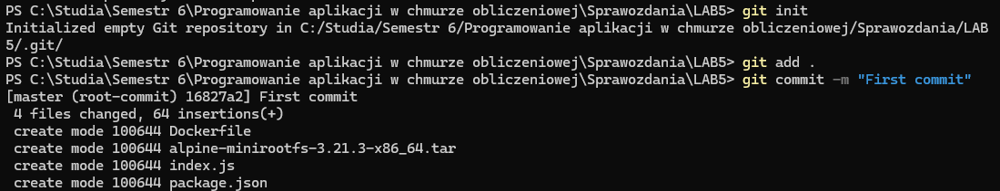
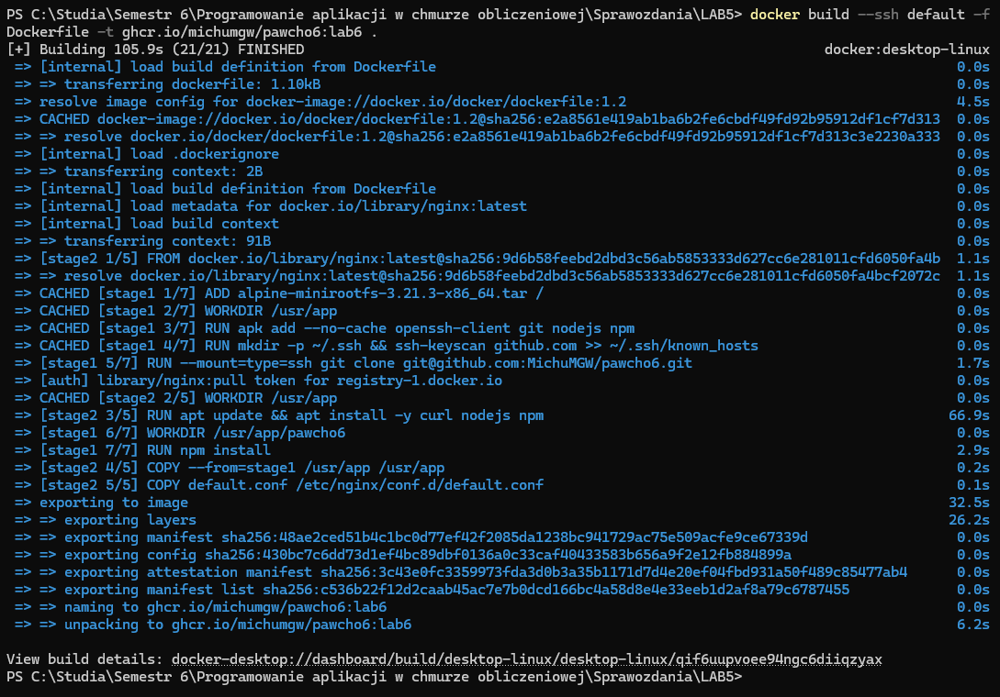
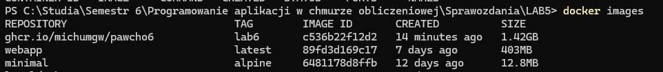
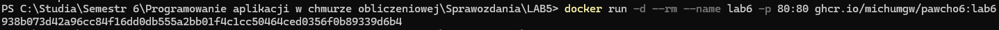
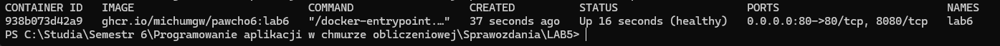
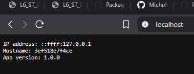

# 1. Inicjalizacja lokalnego repozytorium oraz utworzenie pierwszego commita
```shell
git init
git add .
git commit -m ""
```

# 2. Stworzenie repozytorium przy użyciu gh CLI
```shell
gh repo create pawcho6 --public --source=. --remote=origin --push
```

# 3. Budowanie obrazu
```shell
docker build --ssh default -f Dockerfile -t ghcr.io/michumgw/pawcho6:lab6 .
```

# 4. Potwierdzenie zbudowania obrazu
```shell
docker images
```

# 5. Wysłanie obrazu do repozytorium
```shell
docker push ghcr.io/michumgw/pawcho6:lab6
```
# 6. Uruchomienie kontenera
```shell
docker run -d --rm --name lab6 -p 80:80 ghcr.io/michumgw/pawcho6:lab6
```

# 7. Potwierdzenie działania kontenera
```shell
docker ps
```

# 8. Potwierdzenie działania aplikacji



